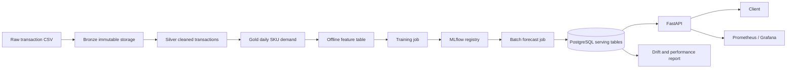

# Sprint 0 - Project Kickoff & Planning

## Trạng thái

`Hoàn thành - nghiệm thu ngày 2026-05-26` theo
`sku_demand_forecasting_sprint_plan.md`.

Sprint này chỉ chốt yêu cầu và contract. Stack FastAPI/PostgreSQL đã dựng trước
được coi là PoC kỹ thuật; không dùng để tuyên bố Sprint 5, 6 hay 8 hoàn thành.

## 1. Scope MVP

Mục tiêu: xây dựng hệ thống dự báo batch cho `15,972` SKU trong `56` ngày tiếp
theo, sau đó phục vụ kết quả forecast đã tính sẵn qua API.

Trong MVP:

- Ingest dữ liệu giao dịch lịch sử.
- Chuẩn hóa dữ liệu thành Bronze, Silver và Gold daily SKU sales.
- Xây dựng feature table offline.
- Huấn luyện LightGBM, đánh giá và đăng ký model bằng MLflow.
- Chạy batch forecast 56 ngày và lưu PostgreSQL.
- Cung cấp FastAPI chỉ đọc kết quả forecast.
- Theo dõi API và báo cáo model cơ bản.
- Deploy Docker Compose trên một VM bằng Ansible.

Ngoài MVP:

- Streaming realtime bằng Kafka hoặc Flink.
- Kubernetes, KServe hoặc Kubeflow.
- Feast online feature store.
- Hạ tầng multi-cluster.

## 2. Kiến trúc MVP được chốt



Ràng buộc kiến trúc: request API không chạy model; model chỉ được gọi trong
batch job theo lịch.

## 3. Metric definition

Đại lượng mục tiêu cho business evaluation là nhu cầu bán không âm theo ngày:

```text
sales_qty = max(Quantity, 0)
```

Return âm vẫn được lưu ở dữ liệu giao dịch và có thể dùng làm feature/report,
nhưng không biến target demand thành giá trị âm.

| Metric | Vai trò | Định nghĩa |
|---|---|---|
| WAPE | Primary KPI của MVP | `sum(abs(actual - forecast)) / sum(actual)` |
| MAE | Secondary | `mean(abs(actual - forecast))` |
| RMSE | Secondary | `sqrt(mean((actual - forecast)^2))` |
| SMAPE | Secondary | `mean(2 * abs(actual - forecast) / (abs(actual) + abs(forecast)))` với xử lý mẫu số 0 |
| WRMSSE | Historical/competition reference | Giữ để so sánh với các submission hiện có, không thay WAPE làm KPI production |

Quy tắc đánh giá:

- Metric càng thấp càng tốt.
- Mọi model candidate phải đánh giá trên cùng forecast horizon 56 ngày và cùng
  rolling validation windows.
- Baseline threshold cụ thể được ghi nhận ở Sprint 4 sau khi pipeline chuẩn tạo
  lại baseline theo data contract này.

## 4. Data contract v0.1

### 4.1. Raw transaction input

Nguồn hiện có: `data/raw/train.csv`.

| Cột | Kiểu logic | Quy tắc |
|---|---|---|
| `Date` | date | Bắt buộc, parse được ngày |
| `Stt` | integer/string identifier | Bắt buộc; nhận diện dòng giao dịch |
| `ItemCode` | string | Bắt buộc, không rỗng |
| `Quantity` | numeric | Bắt buộc; được phép âm để thể hiện return |
| `UnitPrice` | decimal string/numeric | Bắt buộc; có thể dùng định dạng dấu phân cách Việt Nam |
| `SalesAmount` | decimal string/numeric | Bắt buộc |
| `Unit Cost` | decimal string/numeric | Bắt buộc |
| `Cost Amount` | decimal string/numeric | Bắt buộc |

Business rules ban đầu:

- Không xoá return; ghi nhận riêng `return_qty`.
- Target demand là `sales_qty = max(Quantity, 0)`.
- Dữ liệu Bronze giữ nguyên raw input; việc làm sạch chỉ thực hiện từ Silver.

### 4.2. Forecast submission input cho PoC

Nguồn hiện có: `data/raw/sample_submission.csv`.

| Cột | Quy tắc |
|---|---|
| `id` | Dạng `<ItemCode>_validation` hoặc `<ItemCode>_evaluation`, duy nhất |
| `F1` đến `F28` | Numeric, không null, forecast không âm |

Hai phase ghép thành horizon production `1..56`: `validation` ứng với ngày
`1..28`, `evaluation` ứng với ngày `29..56`.

### 4.3. Dataset inventory đã quan sát

| Dataset | Quan sát tại 2026-05-26 |
|---|---:|
| `train.csv` rows | `711,980` |
| SKU phân biệt | `15,972` |
| Date range | `2020-11-17` đến `2025-09-05` |
| Dòng có `Quantity < 0` | `37,434` |
| `sample_submission.csv` rows | `31,944` |
| Validation IDs / evaluation IDs | `15,972` / `15,972` |

## 5. Backlog theo thứ tự gate

| Thứ tự | Sprint | Outcome bắt buộc |
|---:|---|---|
| 0 | Kickoff & Planning | Scope, metric, contract, DoD được nghiệm thu |
| 1 | Foundation & Local Infrastructure | Local stack đủ Postgres/MinIO/MLflow/Airflow/API/monitoring và CI |
| 2 | Bronze/Silver/Gold | Data pipeline idempotent và data quality pass |
| 3 | Feature Engineering | Training frame không leakage và feature metadata |
| 4 | Training & MLflow | Baseline/LightGBM runs, metrics, registered production candidate |
| 5 | Batch Forecasting | Forecast 56 ngày từ model registry ghi serving table |
| 6 | FastAPI Serving | API contract/latency/security smoke tests |
| 7 | Monitoring & Drift | Dashboard, drift report, alerts |
| 8 | Deployment & UAT | CI/CD, Ansible VM deploy, backup/rollback, UAT |

## 6. Definition of Done

Một sprint chỉ được đóng khi:

- Deliverables được lưu trong repository và có owner rõ ràng.
- Code mới qua lint và test liên quan.
- Cấu hình/secrets không hard-code vào source.
- Tác vụ dữ liệu hoặc deploy có lệnh tái chạy được và ghi evidence.
- Acceptance criteria của sprint được đánh dấu có bằng chứng.
- Không gán nhãn production cho PoC hoặc artifact chưa đi qua gate trước.

## 7. Acceptance evidence Sprint 0

| Acceptance criterion | Evidence | Trạng thái |
|---|---|---|
| Scope MVP rõ ràng | Mục 1 tài liệu này | Sẵn sàng xác nhận |
| Kiến trúc MVP thống nhất | Mục 2 | Sẵn sàng xác nhận |
| Có sprint backlog | Mục 5 và `STATUS.md` | Đạt |
| Có schema dữ liệu đầu vào | Mục 4; test contract tự động | Đạt |
| Có tiêu chí đánh giá model | Mục 3 | Sẵn sàng xác nhận |
| Có template repository | Source tree hiện tại | Đạt |

## Gate đã được xác nhận

- `WAPE` là primary production KPI; `WRMSSE` chỉ để đối chiếu submission cũ.
- Target demand loại return âm bằng `max(Quantity, 0)`.
- Triển khai và nghiệm thu lần lượt từ Sprint 1 trở đi.

Phê duyệt được ghi nhận từ yêu cầu triển khai tuần tự của người phụ trách ngày
2026-05-26.
