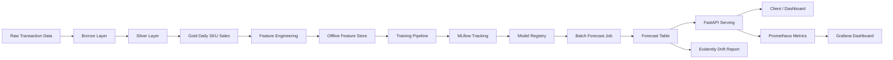

# SKU Demand Forecasting – Detailed Sprint Deployment Plan

## 1. Mục tiêu dự án

Xây dựng và triển khai hoàn chỉnh hệ thống **dự báo nhu cầu bán hàng 56 ngày tiếp theo cho ~15,972 SKU** của nhà phân phối phụ tùng ô tô Việt Nam.

Hệ thống tập trung vào bài toán **batch forecasting**, tức là mô hình dự báo trước kết quả cho toàn bộ SKU theo lịch, sau đó API chỉ đọc kết quả dự báo đã lưu sẵn. Cách này dễ triển khai, dễ vận hành, nhanh khi demo và phù hợp hơn so với real-time model serving cho giai đoạn MVP.

---

## 2. Tech stack triển khai đề xuất

| Nhóm chức năng | Tech stack |
|---|---|
| Data storage | PostgreSQL, MinIO, Parquet |
| Data processing | Python 3.11+, Polars, Pandas, DuckDB |
| Orchestration | Apache Airflow |
| Model training | LightGBM, Scikit-learn |
| Experiment tracking | MLflow |
| Model registry | MLflow Model Registry |
| Batch forecast | Python job chạy qua Airflow |
| Serving | FastAPI |
| Monitoring | Prometheus, Grafana, Evidently AI |
| CI/CD | GitHub Actions, Ansible |
| Deployment | Docker Compose trên VM |
| Testing | Pytest, Great Expectations hoặc Pandera, Locust/k6, Ruff, MyPy optional |

---

## 3. Kiến trúc MVP rút gọn



---

## 4. Nguyên tắc triển khai

### 4.1. Không dùng quá nhiều công nghệ nặng ở MVP

Các thành phần nên để phase sau:

| Thành phần | Lý do chưa dùng ngay |
|---|---|
| Kafka | Bài toán hiện tại chưa cần stream realtime |
| Flink | Chưa cần xử lý event streaming |
| KServe | FastAPI đủ cho batch forecast serving |
| Kubeflow | Airflow dễ triển khai hơn |
| Feast | Offline feature table bằng Parquet/Postgres là đủ |
| Terraform | Chưa cần nếu deploy trên 1 VM |
| Jenkins | GitHub Actions đơn giản hơn |

### 4.2. Ưu tiên batch forecast

API không trực tiếp chạy model mỗi lần user request.

Flow đúng cho MVP:

```text
Airflow schedule daily
→ Build features
→ Load model from MLflow
→ Generate forecast 56 days
→ Save to sku_forecast table
→ FastAPI reads sku_forecast table
```

Lợi ích:

- API phản hồi nhanh.
- Ít rủi ro khi demo.
- Không cần GPU.
- Dễ scale theo số lượng SKU.
- Dễ kiểm soát version model và version forecast.

---

## 5. Cấu trúc repository

```text
sku-demand-forecasting/
├── api/
│   ├── app/
│   │   ├── main.py
│   │   ├── routers/
│   │   ├── schemas/
│   │   ├── services/
│   │   ├── repositories/
│   │   └── config.py
│   ├── tests/
│   └── Dockerfile
│
├── dags/
│   ├── dag_01_ingest_transform.py
│   ├── dag_02_build_features.py
│   ├── dag_03_train_model.py
│   ├── dag_04_batch_forecast.py
│   └── dag_05_monitoring.py
│
├── src/
│   ├── common/
│   │   ├── config.py
│   │   ├── logging.py
│   │   └── db.py
│   ├── ingestion/
│   ├── preprocessing/
│   ├── features/
│   ├── training/
│   ├── forecasting/
│   ├── monitoring/
│   └── evaluation/
│
├── tests/
│   ├── unit/
│   ├── integration/
│   ├── data_quality/
│   ├── model/
│   ├── api/
│   └── e2e/
│
├── infra/
│   ├── docker-compose.yml
│   ├── prometheus/
│   ├── grafana/
│   ├── nginx/
│   └── ansible/
│
├── scripts/
│   ├── init_db.sql
│   ├── seed_sample_data.py
│   └── run_backtest.py
│
├── notebooks/
├── data/
│   ├── raw/
│   ├── bronze/
│   ├── silver/
│   ├── gold/
│   └── features/
│
├── .github/
│   └── workflows/
│       ├── ci.yml
│       └── deploy.yml
│
├── pyproject.toml
├── README.md
└── Makefile
```

---

## 6. Chiến lược test tổng thể

### 6.1. Test pyramid

```text
Unit Test
  - function xử lý dữ liệu
  - feature engineering
  - metric calculation
  - API service logic

Integration Test
  - PostgreSQL connection
  - MinIO connection
  - MLflow tracking
  - Airflow task execution
  - FastAPI + database

Data Quality Test
  - schema validation
  - null validation
  - duplicate validation
  - date range validation
  - business rules

Model Test
  - training run success
  - model artifact load success
  - prediction output shape
  - metric threshold
  - no data leakage

API Test
  - endpoint contract
  - response schema
  - error handling
  - latency
  - load test

End-to-End Test
  - raw data → transform → features → train → forecast → API response
```

### 6.2. Tool test đề xuất

| Loại test | Tool |
|---|---|
| Unit test | Pytest |
| Data validation | Pandera hoặc Great Expectations |
| API test | Pytest + HTTPX |
| Load test | Locust hoặc k6 |
| Code quality | Ruff |
| Type check | MyPy optional |
| Security check | pip-audit hoặc Trivy |
| Docker image scan | Trivy |
| CI/CD test | GitHub Actions |
| Monitoring test | Prometheus scrape test |

### 6.3. Test command chuẩn

```bash
make lint
make test-unit
make test-integration
make test-data
make test-model
make test-api
make test-e2e
```

---

# Sprint 0 – Project Kickoff & Planning

## Mục tiêu

Làm rõ scope, chuẩn hóa requirement, chuẩn bị backlog và thống nhất kiến trúc MVP.

## Thời lượng đề xuất

2–3 ngày.

## Công việc chính

### 0.1. Xác định scope MVP

MVP bao gồm:

- Ingest dữ liệu giao dịch lịch sử.
- Transform thành Bronze/Silver/Gold.
- Build feature table.
- Train model LightGBM.
- Log model vào MLflow.
- Generate forecast 56 ngày cho toàn bộ SKU.
- Lưu kết quả forecast vào PostgreSQL.
- Expose FastAPI để lấy forecast.
- Có monitoring API và basic model report.
- Deploy bằng Docker Compose + Ansible.

MVP chưa bao gồm:

- Kafka streaming.
- Flink stream processing.
- KServe.
- Kubeflow.
- Full feature store Feast.
- Multi-cluster Kubernetes.

### 0.2. Thống nhất metric

Metric nên dùng:

| Metric | Mục đích |
|---|---|
| MAE | Dễ hiểu, đo sai số tuyệt đối |
| RMSE | Phạt mạnh lỗi lớn |
| WAPE | Phù hợp demand forecasting |
| SMAPE | So sánh tương đối |
| RMSSE/WRMSSE | Nếu cần theo hướng competition |

Metric chính đề xuất cho MVP:

```text
Primary metric: WAPE
Secondary metrics: MAE, RMSE, SMAPE
```

### 0.3. Thống nhất dữ liệu đầu vào

Bảng raw transaction gồm các cột dự kiến:

| Cột | Ý nghĩa |
|---|---|
| Date | Ngày giao dịch |
| Stt | Số thứ tự dòng |
| ItemCode | Mã SKU |
| Quantity | Số lượng bán, có thể âm nếu return |
| UnitPrice | Giá bán |
| SalesAmount | Doanh thu |
| Unit Cost | Giá vốn |
| Cost Amount | Tổng giá vốn |

### 0.4. Tạo project backlog

Backlog ban đầu:

- Setup repository.
- Setup Docker Compose.
- Setup database schema.
- Data pipeline.
- Feature engineering.
- Training pipeline.
- MLflow tracking.
- Batch forecast job.
- FastAPI.
- Monitoring.
- CI/CD.
- UAT.

## Testing trong Sprint 0

| Test | Mục tiêu |
|---|---|
| Requirement review | Đảm bảo scope rõ ràng |
| Architecture review | Đảm bảo MVP không bị over-engineering |
| Data contract review | Đảm bảo hiểu đúng schema dữ liệu |
| Metric review | Đảm bảo metric phù hợp business |

## Deliverables

- File README ban đầu.
- Kiến trúc MVP.
- Backlog.
- Definition of Done.
- Metric definition.
- Data contract bản đầu.

## Acceptance Criteria

- Team hiểu rõ scope MVP.
- Có repo rỗng hoặc template repo.
- Có sprint backlog.
- Có schema dữ liệu đầu vào.
- Có tiêu chí đánh giá model.

---

# Sprint 1 – Project Foundation & Local Infrastructure

## Mục tiêu

Khởi tạo project và chạy được toàn bộ hạ tầng local bằng Docker Compose.

## Thời lượng đề xuất

1 tuần.

## Công việc chính

### 1.1. Khởi tạo repository

Tạo cấu trúc thư mục:

```text
api/
src/
dags/
tests/
infra/
scripts/
data/
notebooks/
```

### 1.2. Setup Python environment

Dùng `uv` hoặc `poetry`.

Ví dụ với `uv`:

```bash
uv init
uv add pandas polars duckdb lightgbm scikit-learn mlflow fastapi uvicorn sqlalchemy psycopg2-binary boto3 pytest ruff httpx pandera
```

### 1.3. Setup Docker Compose

Services cần có:

```text
postgres
minio
mlflow
airflow-webserver
airflow-scheduler
airflow-worker optional
redis
forecast-api
prometheus
grafana
nginx optional
```

### 1.4. Setup PostgreSQL schema ban đầu

Tạo database:

```text
sku_forecasting
```

Tạo schema:

```text
raw
bronze
silver
gold
features
modeling
serving
monitoring
```

### 1.5. Setup MLflow

MLflow backend:

```text
PostgreSQL
```

MLflow artifact store:

```text
MinIO
```

### 1.6. Setup Airflow

Tạo connection:

```text
postgres_default
minio_default
mlflow_tracking_uri
```

### 1.7. Setup FastAPI skeleton

Endpoint ban đầu:

```http
GET /health
GET /version
```

### 1.8. Setup Makefile

Các lệnh nên có:

```makefile
up:
	docker compose -f infra/docker-compose.yml up -d

down:
	docker compose -f infra/docker-compose.yml down

logs:
	docker compose -f infra/docker-compose.yml logs -f

test:
	pytest

lint:
	ruff check .
```

## Testing trong Sprint 1

### Unit test

| Test case | Expected result |
|---|---|
| Import được config | Không lỗi |
| Load env variables | Đúng giá trị |
| Health service trả về status | `status = ok` |

### Integration test

| Test case | Expected result |
|---|---|
| Connect PostgreSQL | Thành công |
| Connect MinIO | Thành công |
| Connect MLflow | Thành công |
| FastAPI `/health` | HTTP 200 |
| Airflow webserver start | UI truy cập được |
| Prometheus start | UI truy cập được |
| Grafana start | UI truy cập được |

### Infrastructure smoke test

```bash
docker compose ps
curl http://localhost:8000/health
curl http://localhost:5000
curl http://localhost:9090
```

### CI test

GitHub Actions chạy:

```bash
ruff check .
pytest tests/unit
```

## Deliverables

- Repo structure hoàn chỉnh.
- `docker-compose.yml`.
- `.env.example`.
- FastAPI skeleton.
- MLflow running.
- Airflow running.
- PostgreSQL running.
- MinIO running.
- Prometheus/Grafana running.
- CI workflow cơ bản.

## Acceptance Criteria

- `docker compose up -d` chạy thành công.
- FastAPI trả về `/health`.
- MLflow UI truy cập được.
- Airflow UI truy cập được.
- PostgreSQL và MinIO kết nối được.
- CI pass lint và unit test.

---

# Sprint 2 – Bronze/Silver/Gold Data Pipeline

## Mục tiêu

Xây dựng pipeline biến dữ liệu giao dịch raw thành bảng daily SKU sales dùng cho modeling.

## Thời lượng đề xuất

1 tuần.

## Công việc chính

### 2.1. Raw ingestion

Input:

```text
data/raw/train.csv
```

Output:

```text
raw.transactions
```

Yêu cầu:

- Load toàn bộ dữ liệu.
- Không thay đổi business meaning.
- Lưu ingestion timestamp.
- Lưu source file name.
- Lưu batch id.

Schema gợi ý:

```sql
CREATE TABLE raw.transactions (
    batch_id TEXT,
    source_file TEXT,
    stt BIGINT,
    date_raw TEXT,
    item_code TEXT,
    quantity NUMERIC,
    unit_price_raw TEXT,
    sales_amount NUMERIC,
    unit_cost_raw TEXT,
    cost_amount NUMERIC,
    ingested_at TIMESTAMP DEFAULT CURRENT_TIMESTAMP
);
```

### 2.2. Bronze layer

Output:

```text
bronze.transactions
```

Yêu cầu:

- Chuẩn hóa tên cột.
- Parse kiểu dữ liệu cơ bản.
- Giữ lại bản gần raw nhất.
- Không filter mạnh.

### 2.3. Silver layer

Output:

```text
silver.transactions_clean
```

Yêu cầu clean:

- Parse `Date` sang date.
- Convert `UnitPrice` từ string decimal comma sang numeric.
- Convert `Unit Cost` sang numeric.
- Chuẩn hóa `ItemCode`.
- Xử lý `Quantity` âm.
- Detect row lỗi.
- Tách return quantity nếu cần.

Cột gợi ý:

```text
date
item_code
quantity
sales_quantity
return_quantity
unit_price
sales_amount
unit_cost
cost_amount
is_return
is_valid
error_reason
```

### 2.4. Gold layer

Output:

```text
gold.daily_sku_sales
```

Aggregate theo:

```text
date, item_code
```

Cột gợi ý:

```text
date
item_code
quantity_sold
return_quantity
net_quantity
sales_amount
cost_amount
avg_unit_price
avg_unit_cost
transaction_count
created_at
```

### 2.5. Airflow DAG

Tạo DAG:

```text
dag_01_ingest_transform
```

Tasks:

```text
validate_raw_file
→ ingest_raw
→ build_bronze
→ build_silver
→ build_gold
→ run_data_quality_checks
```

## Testing trong Sprint 2

### Unit test

| Function | Test |
|---|---|
| `parse_decimal_comma()` | `"12,5"` thành `12.5` |
| `parse_date()` | Convert đúng format ngày |
| `normalize_item_code()` | Trim, upper, remove invalid space |
| `split_sales_return()` | Quantity âm thành return |
| `aggregate_daily_sales()` | Group đúng theo date + SKU |

### Data quality test

| Rule | Expected |
|---|---|
| `date` không null | 100% valid |
| `item_code` không null | 100% valid |
| `quantity` numeric | 100% valid |
| `unit_price` numeric hoặc null có kiểm soát | Pass |
| Không duplicate key trong gold | Unique `(date, item_code)` |
| `transaction_count >= 1` | Pass |
| `return_quantity >= 0` | Pass |
| `sales_amount` không lỗi kiểu dữ liệu | Pass |

### Integration test

| Test case | Expected result |
|---|---|
| Load sample CSV vào raw | Thành công |
| Raw → Bronze | Row count không bị mất bất thường |
| Bronze → Silver | Invalid rows được đánh dấu |
| Silver → Gold | Aggregate đúng |
| Airflow DAG dry run | Thành công |

### Idempotency test

Chạy lại cùng một batch:

```text
Expected: Không nhân đôi dữ liệu gold
```

Chiến lược:

- Dùng `batch_id`.
- Hoặc xóa partition/date range trước khi insert lại.
- Hoặc dùng upsert theo key `(date, item_code)`.

## Deliverables

- Raw ingestion script.
- Bronze transform.
- Silver clean transform.
- Gold aggregate transform.
- Airflow DAG `dag_01_ingest_transform`.
- Data quality checks.
- Test suite cho pipeline.

## Acceptance Criteria

- Từ file raw tạo được `gold.daily_sku_sales`.
- Gold table unique theo `(date, item_code)`.
- Pipeline chạy lại không tạo duplicate.
- Data quality checks pass.
- Unit + integration tests pass.

---

# Sprint 3 – Feature Engineering & Offline Feature Store

## Mục tiêu

Tạo feature table phục vụ training và batch forecasting.

## Thời lượng đề xuất

1 tuần.

## Công việc chính

### 3.1. Thiết kế feature groups

#### Time features

```text
day_of_week
day_of_month
week_of_year
month
quarter
is_weekend
is_month_start
is_month_end
```

#### Lag features

```text
lag_1
lag_7
lag_14
lag_28
lag_56
```

#### Rolling features

```text
rolling_mean_7
rolling_mean_14
rolling_mean_28
rolling_mean_56
rolling_std_7
rolling_std_28
rolling_min_28
rolling_max_28
rolling_sum_7
rolling_sum_28
```

#### SKU statistical features

```text
sku_avg_sales
sku_median_sales
sku_sales_std
sku_total_sales
sku_nonzero_sales_ratio
sku_return_rate
sku_first_sale_date
sku_lifecycle_days
```

#### Price features

```text
avg_unit_price
lag_price_1
rolling_price_mean_7
rolling_price_mean_28
price_change_rate
discount_proxy
```

### 3.2. Tạo training frame

Model hóa dạng supervised learning:

```text
Input: feature tại ngày t + horizon h
Output: quantity tại ngày t + h
```

Cột bắt buộc:

```text
as_of_date
item_code
horizon
target_date
target_quantity
features...
```

Horizon:

```text
1 → 56
```

### 3.3. Offline feature store

MVP không cần Feast. Dùng:

```text
features.offline_sku_features
```

hoặc Parquet trên MinIO:

```text
s3://sku-forecasting/features/offline_sku_features/
```

Partition gợi ý:

```text
as_of_date
```

### 3.4. Feature metadata

Tạo file:

```text
feature_registry.yaml
```

Ví dụ:

```yaml
features:
  - name: lag_7
    type: numeric
    source: gold.daily_sku_sales
    description: Quantity sold 7 days before as_of_date
  - name: rolling_mean_28
    type: numeric
    source: gold.daily_sku_sales
    description: Average quantity sold in previous 28 days
```

### 3.5. Airflow DAG

Tạo DAG:

```text
dag_02_build_features
```

Tasks:

```text
load_gold_data
→ generate_base_calendar
→ compute_lag_features
→ compute_rolling_features
→ compute_sku_features
→ build_training_frame
→ validate_features
→ save_offline_features
```

## Testing trong Sprint 3

### Unit test

| Feature | Test |
|---|---|
| `lag_7` | Không dùng dữ liệu tương lai |
| `rolling_mean_7` | Chỉ tính trên quá khứ |
| `is_weekend` | Thứ 7/CN trả true |
| `horizon` | Nằm trong 1..56 |
| `target_date` | Bằng `as_of_date + horizon` |
| `target_quantity` | Match đúng gold table |

### Data leakage test

Bắt buộc kiểm tra:

```text
Feature date <= as_of_date
Target date > as_of_date
```

Test case:

| Rule | Expected |
|---|---|
| Lag features không lấy target day | Pass |
| Rolling features không include current target | Pass |
| Price features không dùng thông tin sau `as_of_date` | Pass |
| Target luôn nằm sau `as_of_date` | Pass |

### Data quality test

| Rule | Expected |
|---|---|
| Không null ở key columns | Pass |
| `horizon` từ 1 đến 56 | Pass |
| `target_quantity >= 0` nếu đã tách return | Pass |
| Feature numeric không chứa inf | Pass |
| Duplicate key `(as_of_date, item_code, horizon)` = 0 | Pass |

### Integration test

| Test case | Expected |
|---|---|
| Gold → Feature table | Thành công |
| Feature table lưu vào Postgres hoặc Parquet | Thành công |
| Airflow DAG chạy end-to-end | Thành công |
| Load feature table cho training | Thành công |

### Performance test

Với ~15,972 SKU và nhiều ngày lịch sử:

| Test | Target |
|---|---|
| Build features sample 10% data | < 5 phút |
| Build full features | Tùy máy, mục tiêu ban đầu < 60 phút |
| Memory không vượt quá giới hạn VM | Pass |

## Deliverables

- Feature engineering module.
- Offline feature table.
- Feature registry.
- Airflow DAG `dag_02_build_features`.
- Test data leakage.
- Data quality checks.

## Acceptance Criteria

- Sinh được training frame với horizon 1..56.
- Không có data leakage.
- Feature table có schema ổn định.
- Training job có thể load feature table.
- Tests pass.

---

# Sprint 4 – Model Training Pipeline & MLflow Registry

## Mục tiêu

Train baseline model LightGBM, đánh giá bằng backtesting, log vào MLflow và đăng ký model vào Model Registry.

## Thời lượng đề xuất

1 tuần.

## Công việc chính

### 4.1. Train/validation split

Không random split.

Dùng time-based split:

```text
Train: dữ liệu trước validation_start_date
Validation: 28 hoặc 56 ngày gần nhất
```

Ví dụ:

```text
train_end_date = max_date - 56 days
validation_start_date = max_date - 55 days
```

### 4.2. Baseline model

Các baseline nên có:

| Model | Mục đích |
|---|---|
| Naive last value | Baseline đơn giản |
| Seasonal naive lag_7 | Baseline theo tuần |
| Moving average 28 | Baseline ổn định |
| LightGBM | Model chính |

### 4.3. LightGBM training

Input:

```text
features.offline_sku_features
```

Output:

```text
LightGBM model artifact
```

Target:

```text
target_quantity
```

Feature chính:

```text
time features
lag features
rolling features
sku features
price features
horizon
```

### 4.4. Evaluation

Metric:

```text
MAE
RMSE
WAPE
SMAPE
```

Cần đánh giá theo:

```text
overall
by horizon
by SKU group
by slow-moving / fast-moving SKU
```

### 4.5. MLflow logging

Log các thông tin:

```text
params
metrics
feature list
training data range
validation data range
model artifact
model signature
input example
source git commit
```

### 4.6. Register model

Model name:

```text
sku-demand-lightgbm
```

Stage:

```text
Staging
```

Nếu metric đạt ngưỡng thì promote:

```text
Production
```

### 4.7. Airflow DAG

Tạo DAG:

```text
dag_03_train_model
```

Tasks:

```text
load_features
→ split_train_validation
→ train_baselines
→ train_lightgbm
→ evaluate_model
→ compare_with_current_production
→ log_to_mlflow
→ register_model_if_pass
```

## Testing trong Sprint 4

### Unit test

| Function | Test |
|---|---|
| `time_based_split()` | Không overlap train/validation |
| `calculate_wape()` | Tính đúng |
| `calculate_smape()` | Tính đúng |
| `build_lgb_dataset()` | Output shape đúng |
| `clip_negative_predictions()` | Không còn dự báo âm |

### Model test

| Test case | Expected |
|---|---|
| Model train thành công trên sample | Pass |
| Model predict được | Pass |
| Prediction length = input length | Pass |
| Không có NaN trong prediction | Pass |
| Negative predictions được xử lý | Pass |
| Metric tốt hơn naive baseline | Pass hoặc warning nếu chưa đạt |

### MLflow integration test

| Test case | Expected |
|---|---|
| Create experiment | Thành công |
| Log params | Thành công |
| Log metrics | Thành công |
| Log artifact | Thành công |
| Load model từ MLflow artifact | Thành công |
| Register model | Thành công |

### Regression test

So sánh model mới với model hiện tại:

| Rule | Action |
|---|---|
| WAPE mới tốt hơn hoặc không tệ hơn quá 5% | Cho phép register |
| WAPE mới tệ hơn > 5% | Không promote |
| Model lỗi predict | Fail pipeline |

### Reproducibility test

Cố định:

```text
random_seed
data_version
feature_version
code_commit
```

Expected:

```text
Chạy lại trên cùng data + config cho kết quả tương đương
```

## Deliverables

- Training pipeline.
- Baseline models.
- LightGBM model.
- Evaluation report.
- MLflow experiment.
- Registered model.
- Model promotion rule.
- Airflow DAG `dag_03_train_model`.

## Acceptance Criteria

- Training pipeline chạy thành công.
- Model được log vào MLflow.
- Model có thể load lại và predict.
- Có evaluation report.
- Có rule so sánh với baseline.
- Model pass test thì được register vào MLflow Model Registry.

---

# Sprint 5 – Batch Forecasting Pipeline

## Mục tiêu

Sinh forecast 56 ngày cho toàn bộ SKU và lưu vào bảng serving.

## Thời lượng đề xuất

1 tuần.

## Công việc chính

### 5.1. Load production model

Nguồn model:

```text
MLflow Model Registry
```

Load model:

```text
models:/sku-demand-lightgbm/Production
```

Nếu chưa có Production model, fallback:

```text
models:/sku-demand-lightgbm/Staging
```

### 5.2. Build inference feature frame

Input:

```text
gold.daily_sku_sales
latest as_of_date
```

Output:

```text
inference frame với 15,972 SKU × 56 horizon
```

Expected row count:

```text
15,972 × 56 = 894,432 rows
```

### 5.3. Generate forecast

Output columns:

```text
run_id
forecast_date
item_code
target_date
horizon
predicted_quantity
model_name
model_version
created_at
```

### 5.4. Save forecast table

Table:

```text
serving.sku_forecast
```

Schema:

```sql
CREATE TABLE serving.sku_forecast (
    run_id TEXT,
    forecast_date DATE,
    item_code TEXT,
    target_date DATE,
    horizon INT,
    predicted_quantity NUMERIC,
    model_name TEXT,
    model_version TEXT,
    created_at TIMESTAMP DEFAULT CURRENT_TIMESTAMP,
    PRIMARY KEY (run_id, item_code, target_date)
);
```

Latest run table:

```text
serving.forecast_runs
```

Schema gợi ý:

```text
run_id
forecast_date
model_name
model_version
status
row_count
started_at
finished_at
error_message
```

### 5.5. Airflow DAG

Tạo DAG:

```text
dag_04_batch_forecast
```

Tasks:

```text
get_latest_model
→ build_inference_features
→ validate_inference_features
→ generate_predictions
→ validate_predictions
→ save_forecast
→ mark_latest_forecast_run
```

## Testing trong Sprint 5

### Unit test

| Function | Test |
|---|---|
| `build_inference_frame()` | Tạo đúng horizon 1..56 |
| `get_target_date()` | target_date = forecast_date + horizon |
| `load_model_from_registry()` | Load đúng model |
| `postprocess_prediction()` | Không âm, round nếu cần |

### Forecast validation test

| Rule | Expected |
|---|---|
| Row count = number_sku × 56 | Pass |
| `horizon` từ 1 đến 56 | Pass |
| `target_date` đúng với `forecast_date + horizon` | Pass |
| `predicted_quantity` không null | Pass |
| `predicted_quantity >= 0` | Pass |
| Không duplicate `(run_id, item_code, target_date)` | Pass |
| Tất cả SKU active đều có forecast | Pass |

### Integration test

| Test case | Expected |
|---|---|
| Load model từ MLflow registry | Thành công |
| Load latest gold data | Thành công |
| Generate forecast sample SKU | Thành công |
| Insert forecast vào Postgres | Thành công |
| Query latest forecast | Thành công |

### Idempotency test

Chạy lại cùng `run_id`:

```text
Expected: Không duplicate, hoặc replace an toàn
```

Chạy run mới:

```text
Expected: Tạo forecast run mới, không phá run cũ
```

### Performance test

| Test | Target |
|---|---|
| Generate 894,432 predictions | < 10 phút cho MVP local/VM |
| Insert forecast rows | < 10 phút nếu dùng batch insert |
| Query forecast 1 SKU | < 300ms |

## Deliverables

- Batch forecasting module.
- Forecast table.
- Forecast run tracking table.
- Airflow DAG `dag_04_batch_forecast`.
- Forecast validation checks.
- Test suite cho forecast.

## Acceptance Criteria

- Sinh forecast đủ 56 ngày cho toàn bộ SKU.
- Forecast được lưu vào database.
- Có tracking forecast run.
- API có thể đọc dữ liệu forecast.
- Forecast validation pass.

---

# Sprint 6 – FastAPI Serving Layer

## Mục tiêu

Xây dựng API để client/dashboard lấy kết quả forecast nhanh và ổn định.

## Thời lượng đề xuất

1 tuần.

## Công việc chính

### 6.1. API endpoints

#### Health check

```http
GET /health
```

Response:

```json
{
  "status": "ok",
  "service": "sku-forecast-api"
}
```

#### Get forecast by SKU

```http
GET /forecast/{item_code}
```

Query params:

```text
days optional, default 56
forecast_date optional
```

#### Get latest forecast run

```http
GET /forecast-runs/latest
```

#### Get forecast metadata

```http
GET /model/current
```

#### Get top demand SKUs

```http
GET /forecast/top-skus?target_date=YYYY-MM-DD&limit=100
```

#### Get forecast summary

```http
GET /forecast/summary?target_date=YYYY-MM-DD
```

### 6.2. Response schema

Example:

```json
{
  "item_code": "SKU-08063",
  "forecast_date": "2026-05-24",
  "model_name": "sku-demand-lightgbm",
  "model_version": "12",
  "forecast": [
    {
      "target_date": "2026-05-25",
      "horizon": 1,
      "predicted_quantity": 12.5
    }
  ]
}
```

### 6.3. Error handling

Các lỗi cần xử lý:

| Case | HTTP status |
|---|---|
| SKU không tồn tại | 404 |
| Không có forecast run | 404 |
| Query params sai | 422 |
| Database lỗi | 500 |
| Service unavailable | 503 |

### 6.4. API performance

Tối ưu:

- Index table `serving.sku_forecast`.
- Query theo latest run.
- Optional Redis cache.
- Pagination cho endpoint trả nhiều SKU.

Index gợi ý:

```sql
CREATE INDEX idx_sku_forecast_item_date
ON serving.sku_forecast(item_code, forecast_date, target_date);

CREATE INDEX idx_sku_forecast_run
ON serving.sku_forecast(run_id);
```

### 6.5. Prometheus metrics

Expose endpoint:

```http
GET /metrics
```

Metrics:

```text
http_requests_total
http_request_duration_seconds
forecast_query_duration_seconds
forecast_not_found_total
database_connection_errors_total
```

## Testing trong Sprint 6

### Unit test

| Component | Test |
|---|---|
| Repository query | Query đúng SQL |
| Service layer | Trả đúng format |
| Schema validation | Pydantic validate đúng |
| Error mapper | Map đúng HTTP status |

### API contract test

| Endpoint | Expected |
|---|---|
| `/health` | 200 |
| `/forecast/{item_code}` valid | 200 |
| `/forecast/{item_code}` invalid | 404 |
| `/forecast-runs/latest` | 200 |
| `/model/current` | 200 |
| `/forecast/top-skus` | 200 |
| `/metrics` | 200 |

### Integration test

| Test case | Expected |
|---|---|
| API connect PostgreSQL | Thành công |
| API đọc latest forecast | Thành công |
| API query SKU forecast | Trả 56 rows |
| API query top SKU | Trả đúng limit |
| API trả metadata model | Thành công |

### Load test

Dùng Locust hoặc k6.

Mục tiêu MVP:

| Scenario | Target |
|---|---|
| 10 concurrent users | p95 latency < 500ms |
| 50 concurrent users | p95 latency < 1000ms |
| Error rate | < 1% |
| `/health` | p95 < 100ms |
| `/forecast/{item_code}` | p95 < 500ms |

### Security test cơ bản

| Test | Expected |
|---|---|
| Không expose stacktrace | Pass |
| Không log secrets | Pass |
| Validate path parameter | Pass |
| CORS config rõ ràng | Pass |

## Deliverables

- FastAPI application.
- API documentation Swagger.
- API tests.
- Prometheus metrics endpoint.
- Dockerfile API.
- Database index migration.

## Acceptance Criteria

- API trả forecast đúng cho SKU.
- API response theo schema.
- API có `/metrics`.
- Load test đạt target MVP.
- API có Docker image chạy được.

---

# Sprint 7 – Monitoring, Drift Detection & Model Observability

## Mục tiêu

Theo dõi sức khỏe hệ thống, chất lượng dự báo và phát hiện drift.

## Thời lượng đề xuất

1 tuần.

## Công việc chính

### 7.1. System monitoring

Dùng:

```text
Prometheus + Grafana
```

Dashboard cần có:

- API request count.
- API latency p50/p95/p99.
- API error rate.
- Database connection status.
- CPU/RAM/Disk.
- Container restart count.
- Airflow DAG success/failure.

### 7.2. Forecast monitoring

Theo dõi:

| Metric | Ý nghĩa |
|---|---|
| Forecast row count | Có đủ SKU × horizon không |
| Forecast missing SKU count | SKU thiếu forecast |
| Prediction min/max/mean | Phân phối dự báo |
| Negative prediction count | Phải bằng 0 |
| Zero prediction ratio | Phát hiện bất thường |
| High demand SKU changes | Detect SKU tăng bất thường |

### 7.3. Model performance monitoring

Khi actual sales mới về, tính:

```text
MAE
RMSE
WAPE
SMAPE
WAPE by horizon
WAPE by SKU group
```

### 7.4. Drift detection

Dùng Evidently AI.

Report:

```text
data drift report
prediction drift report
target drift report khi có actual
```

Input:

```text
reference data: validation period
current data: latest inference features
```

### 7.5. Alert rules

Alert gợi ý:

| Alert | Condition |
|---|---|
| API down | `/health` fail |
| High latency | p95 > 1s trong 5 phút |
| High error rate | error rate > 5% |
| Forecast missing | latest run không đủ row |
| DAG failed | Airflow DAG fail |
| Data drift detected | drift score vượt threshold |
| WAPE degradation | WAPE tăng > 20% so với baseline |

### 7.6. Airflow DAG

Tạo DAG:

```text
dag_05_monitoring
```

Tasks:

```text
check_latest_forecast_run
→ compute_forecast_statistics
→ compute_actual_vs_prediction_if_available
→ run_evidently_drift_report
→ save_monitoring_report
→ send_alert_if_needed
```

## Testing trong Sprint 7

### Monitoring test

| Test case | Expected |
|---|---|
| Prometheus scrape `/metrics` | Thành công |
| Grafana dashboard load | Thành công |
| API latency metric xuất hiện | Pass |
| Forecast query metric xuất hiện | Pass |
| Error counter tăng khi request lỗi | Pass |

### Drift report test

| Test case | Expected |
|---|---|
| Evidently chạy với reference/current sample | Thành công |
| Report HTML được tạo | Thành công |
| Drift metrics được lưu | Thành công |
| Alert trigger khi drift giả lập | Pass |

### Forecast monitoring test

| Rule | Expected |
|---|---|
| Latest forecast run status = success | Pass |
| Row count đủ | Pass |
| Negative prediction count = 0 | Pass |
| Missing active SKU = 0 | Pass |
| Horizon coverage đủ 1..56 | Pass |

### Airflow monitoring DAG test

| Test case | Expected |
|---|---|
| DAG parse không lỗi | Pass |
| Task check_latest_forecast_run chạy được | Pass |
| Task run_evidently_drift_report chạy được | Pass |
| DAG fail nếu forecast missing | Pass |

## Deliverables

- Prometheus config.
- Grafana dashboard.
- Evidently drift report job.
- Monitoring DAG.
- Alert rules.
- Forecast quality report.

## Acceptance Criteria

- Có dashboard quan sát API/system.
- Có report drift.
- Có check forecast quality.
- Có alert rule cơ bản.
- Monitoring DAG chạy được.

---

# Sprint 8 – CI/CD, Deployment Automation & UAT

## Mục tiêu

Tự động hóa build/test/deploy và hoàn thiện hệ thống để demo/production MVP.

## Thời lượng đề xuất

1 tuần.

## Công việc chính

### 8.1. GitHub Actions CI

Workflow `ci.yml`:

```text
on pull request / push
→ install dependencies
→ lint
→ unit test
→ integration test optional
→ build docker images
```

### 8.2. Docker image build

Images:

```text
sku-forecast-api
sku-forecast-pipeline
```

Optional:

```text
custom-airflow
```

### 8.3. Ansible deployment

Playbook:

```text
infra/ansible/deploy.yml
```

Steps:

```text
SSH to VM
→ pull latest code or docker image
→ update .env
→ docker compose pull
→ docker compose up -d
→ run health check
```

### 8.4. Backup strategy

Backup:

| Component | Backup |
|---|---|
| PostgreSQL | Daily pg_dump |
| MinIO artifacts | Bucket backup |
| MLflow metadata | PostgreSQL backup |
| Config | Git versioning |

### 8.5. UAT scenario

End-to-end user acceptance test:

```text
1. Upload/load new transaction data
2. Airflow runs ingestion
3. Airflow builds features
4. Training runs or model loads existing production model
5. Batch forecast generated
6. API returns forecast for selected SKU
7. Dashboard shows system metrics
8. Monitoring report generated
```

### 8.6. Release checklist

- `.env.production` configured.
- Secrets không commit vào Git.
- Database migrations applied.
- MLflow artifact bucket exists.
- API health check pass.
- Airflow DAGs enabled.
- Grafana dashboard imported.
- Backup cron enabled.
- Rollback plan ready.

## Testing trong Sprint 8

### CI test

| Test case | Expected |
|---|---|
| Pull request chạy lint | Pass |
| Pull request chạy unit test | Pass |
| Docker build không lỗi | Pass |
| Security scan không có critical issue | Pass |

### Deployment test

| Test case | Expected |
|---|---|
| Ansible SSH thành công | Pass |
| Docker Compose start services | Pass |
| API health check sau deploy | Pass |
| MLflow UI accessible | Pass |
| Airflow UI accessible | Pass |
| Prometheus/Grafana accessible | Pass |

### End-to-end test

| Step | Expected |
|---|---|
| Raw data ingestion | Success |
| Bronze/Silver/Gold transform | Success |
| Feature generation | Success |
| Training pipeline | Success |
| MLflow register model | Success |
| Batch forecast | Success |
| API query forecast | Success |
| Monitoring report | Success |

### Rollback test

| Scenario | Expected |
|---|---|
| Deploy image lỗi | Rollback image trước đó |
| API health fail | Stop release |
| Forecast job fail | Giữ latest successful run |
| Model mới tệ hơn | Không promote model |

### Backup/restore test

| Test | Expected |
|---|---|
| PostgreSQL backup tạo file | Pass |
| Restore vào database test | Pass |
| MLflow artifact còn truy cập được | Pass |

## Deliverables

- GitHub Actions CI/CD.
- Docker images.
- Ansible playbook.
- Production `.env.example`.
- Deployment guide.
- UAT report.
- Backup/rollback guide.

## Acceptance Criteria

- Push code có CI kiểm tra.
- Deploy bằng 1 command hoặc 1 workflow.
- Hệ thống chạy trên VM.
- API trả forecast.
- Monitoring hoạt động.
- Có rollback và backup cơ bản.
- UAT pass.

---

# 7. Timeline tổng thể

| Sprint | Nội dung | Thời lượng |
|---|---|---|
| Sprint 0 | Planning & scope | 2–3 ngày |
| Sprint 1 | Foundation & infrastructure | 1 tuần |
| Sprint 2 | Bronze/Silver/Gold pipeline | 1 tuần |
| Sprint 3 | Feature engineering | 1 tuần |
| Sprint 4 | Training & MLflow | 1 tuần |
| Sprint 5 | Batch forecasting | 1 tuần |
| Sprint 6 | FastAPI serving | 1 tuần |
| Sprint 7 | Monitoring & drift | 1 tuần |
| Sprint 8 | CI/CD, deployment & UAT | 1 tuần |

Tổng thời gian MVP:

```text
8–9 tuần nếu làm chuẩn
4–5 tuần nếu rút gọn và có sẵn người triển khai
```

---

# 8. Bảng ưu tiên triển khai

## Must-have cho MVP

| Thành phần | Bắt buộc |
|---|---|
| Bronze/Silver/Gold | Có |
| Feature engineering | Có |
| LightGBM model | Có |
| MLflow tracking | Có |
| Batch forecast | Có |
| Forecast table | Có |
| FastAPI | Có |
| Docker Compose | Có |
| Unit/integration/data tests | Có |
| Basic monitoring | Có |

## Should-have

| Thành phần | Mức độ |
|---|---|
| Evidently drift | Nên có |
| Grafana dashboard | Nên có |
| GitHub Actions deploy | Nên có |
| Ansible deployment | Nên có |
| Load test | Nên có |

## Could-have

| Thành phần | Mức độ |
|---|---|
| Redis cache | Có thể thêm |
| Nginx reverse proxy | Có thể thêm |
| Advanced dashboard | Có thể thêm |
| Automated retraining trigger | Có thể thêm |

## Phase sau

| Thành phần | Khi nào dùng |
|---|---|
| Kafka | Khi có sales events realtime |
| Flink | Khi cần stream features realtime |
| Feast | Khi nhiều model dùng chung feature |
| KServe | Khi cần Kubernetes-native model serving |
| Kubeflow | Khi training pipeline rất phức tạp |
| Terraform | Khi cần provision cloud infra chuẩn production |

---

# 9. Definition of Done chung

Một sprint được coi là hoàn thành khi:

- Code đã merge vào main branch.
- Có unit test cho logic chính.
- Có integration test nếu có kết nối external service.
- Có data quality test nếu xử lý dữ liệu.
- Có documentation cập nhật.
- Docker build không lỗi.
- CI pass.
- Không có secret hard-code.
- Có log đủ để debug.
- Có acceptance criteria được kiểm chứng.

---

# 10. Checklist cuối dự án

## Data pipeline

- [ ] Raw ingestion chạy được.
- [ ] Bronze table có dữ liệu.
- [ ] Silver table clean đúng.
- [ ] Gold daily SKU sales unique theo date + SKU.
- [ ] Data quality checks pass.
- [ ] Pipeline idempotent.

## Feature pipeline

- [ ] Feature table sinh đúng.
- [ ] Có horizon 1..56.
- [ ] Không data leakage.
- [ ] Feature registry có mô tả.
- [ ] Feature quality checks pass.

## Model pipeline

- [ ] Baseline model có kết quả.
- [ ] LightGBM train được.
- [ ] MLflow log params/metrics/artifacts.
- [ ] Model load lại được.
- [ ] Model được register.
- [ ] Metric tốt hơn baseline hoặc có lý do chấp nhận.

## Forecast pipeline

- [ ] Load được production model.
- [ ] Forecast đủ SKU × 56 ngày.
- [ ] Không có prediction âm.
- [ ] Forecast run được tracking.
- [ ] Latest successful run được đánh dấu.

## API

- [ ] `/health` pass.
- [ ] `/forecast/{item_code}` pass.
- [ ] `/forecast-runs/latest` pass.
- [ ] `/model/current` pass.
- [ ] `/metrics` pass.
- [ ] API latency đạt target.

## Monitoring

- [ ] Prometheus scrape được API.
- [ ] Grafana dashboard hoạt động.
- [ ] Forecast quality check hoạt động.
- [ ] Evidently report tạo được.
- [ ] Alert rule cơ bản có sẵn.

## Deployment

- [ ] Docker Compose production chạy được.
- [ ] GitHub Actions CI pass.
- [ ] Ansible deploy pass.
- [ ] Backup PostgreSQL chạy được.
- [ ] Rollback plan test được.
- [ ] UAT pass.

---

# 11. Gợi ý thứ tự làm nhanh nếu cần demo sớm

Nếu chỉ có 2–3 tuần để demo, rút gọn như sau:

## Week 1

- Setup Docker Compose.
- Build Bronze/Silver/Gold.
- Build feature engineering.
- Train LightGBM local.

## Week 2

- Setup MLflow.
- Batch forecast 56 ngày.
- Save forecast table.
- Build FastAPI.

## Week 3

- Add Airflow DAGs.
- Add basic tests.
- Add Grafana/Prometheus.
- Deploy bằng Ansible hoặc manual Docker Compose.

Minimal demo flow:

```text
CSV → Gold table → Features → LightGBM → Forecast table → FastAPI → Dashboard
```

---

# 12. Rủi ro và cách giảm thiểu

| Rủi ro | Ảnh hưởng | Cách xử lý |
|---|---|---|
| Dữ liệu return âm làm sai demand | Model học sai | Tách `sales_quantity` và `return_quantity` |
| SKU bán thưa | Forecast nhiều số 0 | Segment slow-moving SKU |
| Data leakage ở rolling feature | Metric ảo | Bắt buộc leakage test |
| Model overfit SKU lớn | SKU nhỏ forecast kém | Evaluate theo SKU group |
| Insert forecast chậm | Pipeline lâu | Batch insert/copy, index hợp lý |
| API query chậm | Demo kém | Index + latest run cache |
| Model mới tệ hơn | Giảm chất lượng | Promotion rule trong MLflow |
| DAG chạy lại tạo duplicate | Sai dữ liệu | Idempotent design |
| Drift không được phát hiện | Model xuống cấp | Evidently + actual vs forecast monitoring |
| Deploy lỗi | Downtime | Rollback image + health check |

---

# 13. Kết luận

Plan triển khai tốt nhất cho bài toán SKU là đi theo hướng:

```text
Airflow + PostgreSQL + MinIO + Polars/DuckDB + LightGBM + MLflow + FastAPI + Prometheus/Grafana + Docker Compose + Ansible
```

Đây là stack đủ chuẩn MLOps nhưng vẫn dễ triển khai. Trọng tâm của MVP không phải real-time streaming hay Kubernetes-native serving, mà là:

```text
Batch data pipeline
→ robust feature engineering
→ reliable forecasting
→ forecast serving API
→ monitoring and retraining readiness
```
